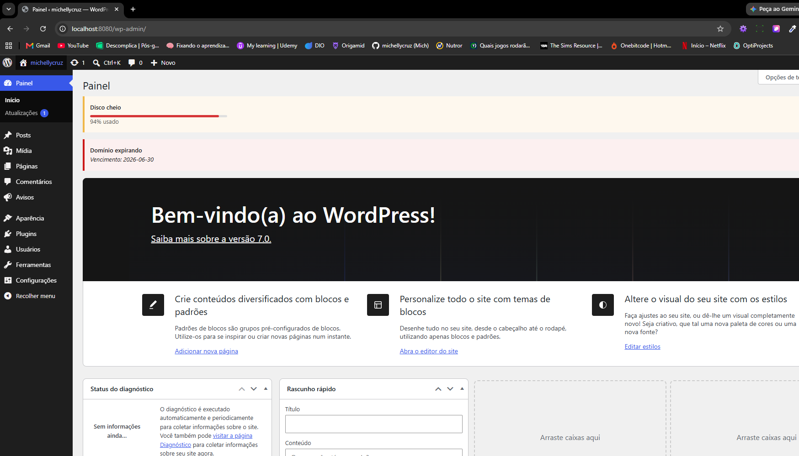
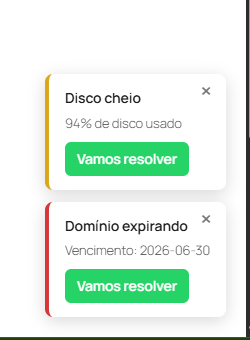

# Hostbraza Avisos

Plugin WordPress que exibe avisos de hospedagem (domínio expirando, conta a vencer, disco cheio) para o administrador do site, tanto em um banner no painel quanto em notificações flutuantes (*toasts*) no site. Foi construído com uma arquitetura preparada para, no futuro, consumir avisos diretamente de uma API externa da Hostbraza, mantendo também o cadastro manual.

---

## Índice

- [Visão geral](#visão-geral)
- [Funcionalidades](#funcionalidades)
- [Requisitos](#requisitos)
- [Instalação](#instalação)
- [Como usar](#como-usar)
- [Estrutura do projeto](#estrutura-do-projeto)
- [Configurando a integração com a API](#configurando-a-integração-com-a-api)
- [Decisões de arquitetura](#decisões-de-arquitetura)
- [Segurança](#segurança)
- [Autoria](#autoria)
- [Licença](#licença)

---

## Visão geral

O **Hostbraza Avisos** centraliza os comunicados de hospedagem importantes em um único lugar dentro do WordPress do cliente. Cada aviso é um *Custom Post Type*, o que permite reaproveitar as telas nativas de criação e edição do WordPress. Os avisos são exibidos em dois pontos:

1. **Banner no painel administrativo** — uma tarja no topo das telas do `wp-admin`, colorida conforme a severidade.
2. **Toast no site** — uma notificação flutuante no canto inferior direito, visível **apenas para administradores**, que pode ser fechada e traz um botão direto para o WhatsApp do suporte.

Toda a leitura de avisos passa por uma única função (`hbav_get_avisos()`), o que permite trocar a origem dos dados (cadastro manual ou API) sem alterar o restante do plugin.

---

## Funcionalidades

- Cadastro manual de avisos via *Custom Post Type* "Aviso".
- Campos personalizados: tipo (domínio, conta, disco), severidade (informativo, atenção, urgente), data de vencimento e percentual de uso de disco.
- Banner administrativo com cor por severidade e exibição de percentual de disco.
- Toast flutuante no site, restrito a administradores, com:
  - fechamento individual que persiste pelo dia (via `localStorage`);
  - barra/percentual para avisos de disco e data para os demais;
  - botão "Vamos resolver" que abre o WhatsApp do suporte com mensagem pré-preenchida.
- Campos expostos na API REST do WordPress.
- Camada de integração com API externa pronta para ser ativada (desativada por padrão).

---

## Demonstração

### Banner no painel administrativo
Avisos exibidos no topo do painel, com cor por severidade e barra de uso de disco.



### Notificações no site (toasts)
Notificações flutuantes no canto inferior direito, visíveis apenas para administradores do site (manage_options), com botão de acesso ao WhatsApp do suporte.



---

## Requisitos

- WordPress 6.5 ou superior
- PHP 8.0 ou superior

---

## Instalação

1. Copie a pasta `hostbraza-avisos` para o diretório `wp-content/plugins/` do seu WordPress.
2. No painel, acesse **Plugins** e ative o **Hostbraza Avisos**.
3. Um novo item de menu chamado **Avisos** aparecerá na barra lateral.

> O plugin já vem funcional com o cadastro manual. A integração com a API é opcional e desativada por padrão.

---

## Como usar

1. No menu **Avisos**, clique em **Adicionar novo aviso**.
2. Preencha o título e, no painel **Detalhes do aviso**, selecione:
   - **Tipo do aviso**: domínio expirando, conta a vencer ou disco cheio;
   - **Severidade**: informativo, atenção ou urgente;
   - **Data de vencimento** (para domínio/conta) ou **Uso de disco (%)** (para disco).
3. Publique o aviso.

O aviso passará a aparecer automaticamente no banner do painel e no toast do site (para administradores).

---

## Estrutura do projeto

```
hostbraza-avisos/
├── hostbraza-avisos.php           # Arquivo principal: cabeçalho e carregamento dos módulos
├── includes/
│   ├── class-cpt.php              # Registra o Custom Post Type "Aviso"
│   ├── class-meta.php             # Campos personalizados + salvamento seguro (nonce, sanitização)
│   ├── class-avisos-fonte.php     # Fonte única de dados (manual + API) — coração da arquitetura
│   ├── class-admin-notice.php     # Banner de avisos no painel administrativo
│   ├── class-meta-rest.php        # Expõe os campos do aviso na API REST
│   └── class-toast.php            # Toast flutuante no site (apenas admin) + link de WhatsApp
├── README.md                      # Esta documentação
└── readme.txt                     # Documentação no formato do repositório WordPress
```

---

## Configurando a integração com a API

A camada de API fica no arquivo **`includes/class-avisos-fonte.php`**, no bloco de configuração no topo. Por padrão, a integração está **desativada** e o plugin usa apenas o cadastro manual.

Para ativar a integração quando a API da Hostbraza estiver disponível, edite as constantes:

```php
// includes/class-avisos-fonte.php

define( 'HBAV_API_ATIVA', true );                                  // Liga a integração
define( 'HBAV_API_URL', 'https://api.hostbraza.com.br/avisos' );   // Endereço da API
define( 'HBAV_API_TOKEN', 'SEU_TOKEN_AQUI' );                      // Token de autenticação
define( 'HBAV_API_CLIENTE_ID', 'ID_DO_CLIENTE' );                  // Identificador do cliente
```

Passos:

1. **`HBAV_API_ATIVA`** — altere para `true`.
2. **`HBAV_API_URL`** — informe o endpoint que devolve a lista de avisos.
3. **`HBAV_API_TOKEN`** — informe a chave de autenticação fornecida pela Hostbraza.
4. **`HBAV_API_CLIENTE_ID`** — informe o identificador deste cliente na Hostbraza.

### Formato esperado da resposta

A função `hbav_get_avisos_api()` espera um JSON no formato:

```json
[
  {
    "id": 1,
    "titulo": "Disco cheio",
    "mensagem": "Seu disco está quase no limite.",
    "tipo": "disco",
    "severidade": "urgente",
    "vencimento": "",
    "percentual": 94
  }
]
```

Se os nomes dos campos da API real forem diferentes, ajuste o mapeamento no bloco de **conversão** dentro de `hbav_get_avisos_api()` — ele está comentado no código.

### Comportamento

- Os avisos da API são **somados** aos manuais (coexistência).
- O resultado é armazenado em cache por 15 minutos, evitando chamadas excessivas.
- Se a API estiver fora do ar ou retornar erro, o plugin **não quebra**: apenas exibe os avisos manuais.

---

## Decisões de arquitetura

- **Custom Post Type** para reaproveitar as telas nativas do WordPress.
- **Fonte única de dados** (`hbav_get_avisos()`): todo o restante do plugin lê dela, então a origem dos dados pode mudar sem refatoração.
- **Toast restrito a administradores** (`manage_options`): evita que outros usuários logados no site do cliente (assinantes, clientes de loja) vejam avisos operacionais.
- **Cache via transients** na camada de API para desempenho.

---

## Segurança

- Verificação de **nonce** no salvamento dos campos.
- **Sanitização** de toda entrada (`sanitize_text_field`, `wp_unslash`, `absint`, listas brancas).
- **Escaping** de toda saída (`esc_html`, `esc_attr`, `esc_url`).
- Verificação de **capacidade** do usuário (`current_user_can`).
- Proteção contra acesso direto aos arquivos (`ABSPATH`).

---

## Autoria

Desenvolvido por **Michelly Cruz**.

---

## Licença

Distribuído sob a licença **GPL v2 ou posterior**, em conformidade com o padrão dos plugins WordPress.
